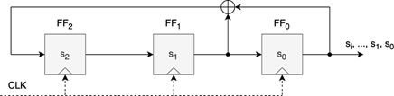

# Kryptografia i kryptoanaliza
## Laboratorium 4
### Grupa 22B
### Autorzy: Przemysław Kałużiński, Michał Kaczor

### Zadanie 1

Dokonaj implementacji rejestru przesuwnego z liniowym sprzężeniem zwrotnym LFSR. Rejestr ten powinien:

Przyjmować parametry:
- sekwencję zer i jedynek, inicjującą stan początkowy rejestru, wartość m, która określa stopień rejestru a tym samym ilość jego stanów,
- sekwencję liczb całkowitych określających połączenia sprzężenia zwrotnego rejestru,
- dodatnią liczbę całkowitą określającą długość wyjściowego strumienia bitów (zer i jedynek).

Zwracać wyjściowy strumień bitów.

**Przykład.** Rejestr przesuwny z liniowym sprzężeniem zwrotnym stopnia m = 3.

  
Rysunek 1: Liniowy rejestr przesuwający ze sprzężeniem zwrotnym stopnia 3

Powyższy rejestr zdefiniowany może być przy pomocy wielomianu (w porządku rosnącym): $C(x) = p_0x^0 + p_1x^1 + p_2x^2 + x^3$ gdzie p0, p1, p2 przyjmują odpowiednio wartości 1, 1, 0, co daje: $C(x) = 1 + x + x^3$.

Powyższy rejestr, którego stan początkowy określa sekwencja $s_0 = 0$, $s_1 = 0$ oraz $s_2 = 1$, wygeneruje sekwencję wyjściową w postaci: [0, 0, 1, 0, 1, 1, 1, 0, 0, 1, 0, 1, 1, 1], przyjmując że żądana długość strumienia wyjściowego wynosi 14.

#### Implementacja

**1. Funkcja `lfsr`**

**Wejście:**
- `initial_state` (list): Początkowy stan rejestru jako lista bitów (np. [0, 0, 1]).
- `taps` (list): Indeksy pozycji używanych do obliczenia nowego bitu (np. [0, 1]).
- `output_length` (int): Długość generowanej sekwencji wyjściowej.

**Wyjście:**
- `output` (list): Wygenerowana sekwencja bitów.

**Opis:**  
Funkcja implementuje działanie rejestru przesuwnego z liniowym sprzężeniem zwrotnym (LFSR). Na podstawie początkowego stanu rejestru i wskazanych pozycji (taps) oblicza nowy bit jako XOR odpowiednich bitów. Następnie przesuwa rejestr w prawo i dodaje nowy bit na koniec. Proces jest powtarzany aż do wygenerowania sekwencji o żądanej długości.

**Kod:**
``` python
def lfsr(initial_state, taps, output_length):
    state = initial_state.copy()
    output = []

    for _ in range(output_length):
        # Zapisz obecny bit wyjściowy
        output.append(state[0])

        # Oblicz nowy bit jako XOR wskazanych pozycji (taps)
        new_bit = 0
        for t in taps:
            new_bit ^= state[t]

        # Przesunięcie rejestru w prawo i wstawienie nowego bitu
        state = state[1:] + [new_bit]

    return output
```

**2. Funkcja `main`**

**Wejście:**
- Brak bezpośrednich argumentów wejściowych. Pobiera dane z wiersza poleceń.

**Wyjście:**
- Wyświetla wygenerowaną sekwencję bitów na standardowym wyjściu.

**Opis:**  
Funkcja główna programu, która korzysta z modułu `argparse` do parsowania argumentów wiersza poleceń. Przyjmuje trzy argumenty: początkowy stan rejestru (`--initial_state`), indeksy sprzężenia zwrotnego (`--taps`) oraz długość sekwencji wyjściowej (`--output_length`). Następnie wywołuje funkcję `lfsr` i wyświetla wynik.

**Kod:**
``` python
def main():
    parser = argparse.ArgumentParser(description="LFSR Generator")

    # Definicja flag
    parser.add_argument('--initial_state', '-i', nargs='+', type=int, required=True,
                        help="Stan początkowy rejestru jako lista bitów, np. 0 0 1")
    parser.add_argument('--taps', '-t', nargs='+', type=int, required=True,
                        help="Indeksy sprzężenia zwrotnego, licząc od 0 (od lewej do prawej), np. 0 1")
    parser.add_argument('--output_length', '-o', type=int, required=True,
                        help="Żądana długość strumienia wyjściowego")

    args = parser.parse_args()

    # Wywołanie funkcji LFSR
    output = lfsr(args.initial_state, args.taps, args.output_length)

    # Wyświetlenie wyniku
    print("Wygenerowana sekwencja:", output)
```

#### Wyniki

### Zadanie 2

Wykorzystaj program z zadania pierwszego do utworzenia rejestrów LFSR opisanych wielominanami:

1. $C(x) = 1 + x^2 + x^5$ 
2. $C(x) = 1 + x + x^3 + x^5$  

Przyjmując, że:  
- sekwencja inicjująca ma postać: [1,0,0,1,0], (uwaga, kolejność bitów w odniesieniu do stanów: $s_0, s_1, s_2, s_3, s_4$),  
- oraz że żądana długość sekwencji wyjściowej wynosi 25,  

to dla zdefiniowanych kolejno rejestrów, sekwencja wyjściowa powinna być następująca:  

1. [1, 0, 0, 1, 0, 1, 1, 0, 0, 1, 1, 1, 1, 1, 0, 0, 0, 1, 1, 0, 1, 1, 1, 0, 1]  
2. [1, 0, 0, 1, 0, 0, 0, 1, 1, 1, 1, 0, 1, 0, 1, 1, 0, 0, 1, 0, 0, 0, 1, 1, 1]  

#### Implementacja


#### Wyniki

### Zadanie 3

Na podstawie otrzymanych w poprzednich zadaniach, sekwencji bitów generatora. Zidentyfikuj parametry rejestru LFSR, który został użyty do wygenerowania tych sekwencji. Parametrami podlegającymi identyfikacji są:  

- sekwencja początkowa (seed),  
- wektor określający sprzężenia zwrotne, które wchodzą do obliczeń XOR (taps).  

W tym celu wykorzystaj algorytm Berlekamp – Massey, który pracuje nad polem GF(2). Algorytm ten jest efektywnym narzędziem służącym do znalezienia minimalnego wielomianu połączeń dla danej sekwencji nad ciałem skończonym GF(q) (w ogólnym przypadku).  

Algorytm ten korzystając z danej sekwencji bitów, powinien wygenerować informacje o złożoności liniowej L oraz wielomian połączeń C, czyli:  

- _Złożoność liniowa L_: to najmniejsza liczba poprzednich elementów sekwencji potrzebna do wyznaczenia kolejnego elementu w sposób liniowy.  
- _Wielomian połączeń C(x)_: Wielomian opisujący zależności między elementami sekwencji.  

Algorytm iteracyjnie analizuje sekwencję, obliczając rozbieżność d między przewidywaną a rzeczywistą wartością sekwencji, następnie aktualizuje wielomian połączeń C(x) oraz złożoność liniową L, gdy jest to konieczne.  

---

**Algorithm 1** Algorytm Berlekamp-Massey  

---

**Require:** Sekwencja $s = [s_0, s_1, . . ., s_{n−1}]$ nad GF(2)  
**Ensure:** Wielomian połączeń C(x) oraz złożoność liniowa L  

```
1: n ← długość sekwencji s  
2: C(x) ← [1]    ► Inicjalizacja wielomianu połączeń  
3: B(x) ← [1]    ► Kopia poprzedniego wielomianu  
4: L ← 0    ► Złożoność liniowa  
5: m ← −1    ► Indeks ostatniej aktualizacji  
6: for N ← 0 do n − 1 do  
7:     _d ←_ _sN_  
8:     **for i ← 1 do L do**  
9:         _d ←_ _d ⊕_ (Ci · sN−i)    ► Oblicz rozbieżność d  
10:     **end for**  
11:     **if d = 0 then**  
12:         **continue** ► Brak potrzeby aktualizacji  
13:     **end if**  
14:     _T(x) ←_ _C(x)_ ► Kopia aktualnego wielomianu C(x)  
15:     _δ ←_ _N −_ _m_  
16:     **for i ← 0 do |B(x)| − 1 do**  
17:         _Cδ+i ←_ _Cδ+i ⊕_ _Bi_ ► Aktualizacja C(x)  
18:     **end for**  
19:     **if 2L ≤** _N then_  
20:         _L ←_ _N + 1 −_ _L_  
21:         _B(x) ←_ _T(x)_  
22:         _m ←_ _N_  
23:     **end if**  
24: **end for**  
25: return C(x), L  
```

**Objaśnienie algorytmu:**  

1. **Inicjalizacja:**  
   - *B(x)*: kopia pomocnicza wielomianu połączeń, również [1].  
   - *L*: złożoność liniowa sekwencji, początkowo 0.  
   - *m*: indeks ostatniej aktualizacji wielomianu połączeń, początkowo -1.  

2. **Pętla główna (dla każdego elementu sekwencji):**  
   - **Obliczenie rozbieżności** _d_:  
     $d=s_{N}\oplus\left(\bigoplus_{i=1}^{L}C_{i}\cdot s_{N-i}\right)$  
     - Rozbieżność _d_ określa, czy aktualny wielomian połączeń poprawnie przewiduje wartość _sN_.  
   - **Jeśli** _d=0_:  
     - Aktualny wielomian _C(x)_ poprawnie przewiduje $s_N$, to przechodzimy do następnej iteracji.  
   - **Jeśli** _d≠0_:  
     - Kopia _T(x)_: zachowujemy aktualny wielomian w _T(x)_.  
     - Aktualizacja _C(x)_:  
       $C(x)=C(x)\oplus x^{\delta}\cdot B(x)$  
       gdzie _δ=N-m_.  
     - Aktualizacja parametrów, jeśli _2L≤N_:  
       - _L=N+1-L_: aktualizujemy złożoność liniową.  
       - _B(x)=T(x)_: ustawiamy _B(x)_ na poprzedni _C(x)_.  
       - _m=N_: aktualizujemy indeks ostatniej zmiany.  

3. **Zakończenie:**  
   - Po przetworzeniu całej sekwencji zwracamy wielomian połączeń _C(x)_ i złożoność liniową _L_.  

**Uwagi**  
- Wszystkie operacje wykonywane są w ciele _GF(2)_, czyli modulo 2.  
- Wielomiany reprezentowane są jako listy współczynników, gdzie $C_i$ to współczynnik przy $x_i$.  
- Operator _⊕_ reprezentuje dodawanie modulo 2 (operację XOR).  
- Symbol _⨁_ oznacza sumę modulo 2 wielu składników.  
- Algorytm wygeneruje wektor współczynników wielomianu _C_ w porządku malejącym.  

**Przykład obliczeń**  

Założmy, że:  
- Złożoność liniowa _L=3_.  
- Współczynniki wielomianu połączeń:  
  - $C_1=1$  
  - $C_2=0$  
  - $C_3=1$  
- Elementy sekwencji:  
  - $s_N=0$  
  - $s_N-1=1$  
  - $s_N-2=0$  
  - $s_N-3=1$  

**Obliczenie rozbieżności d:**  
$d = sN ⊕ (⨁_{i=1}^3 Ci · sN-i)$  
$= 0 ⊕ ((1 · 1) ⊕ (0 · 0) ⊕ (1 · 1))$  
$= 0 ⊕ (1 ⊕ 0 ⊕ 1)$  
$= 0 ⊕ 0$  
$= 0$  

#### Implementacja

**1. Funkcja `berlekamp_massey`**

**Wejście:**
- `sequence` (list): Sekwencja bitów wejściowych (np. [1, 0, 1, 0, 1]).

**Wyjście:**
- `C` (list): Wielomian połączeń (odwrócony, aby pasował do generatora LFSR).
- `L` (int): Złożoność liniowa sekwencji.

**Opis:**  
Funkcja implementuje algorytm Berlekampa-Masseya dla ciała GF(2). Algorytm ten służy do znajdowania najkrótszego rejestru LFSR, który może wygenerować daną sekwencję bitów. Funkcja oblicza rozbieżność, aktualizuje wielomian połączeń oraz śledzi złożoność liniową. Wynikowy wielomian jest odwracany, aby pasował do formatu używanego w zadaniu 1.

**Kod:**
``` python
def berlekamp_massey(sequence):
    n = len(sequence)

    C = [1]  # Wielomian połączeń (connection polynomial)
    B = [1]  # Kopia pomocnicza wielomianu połączeń
    L = 0    # Złożoność liniowa
    m = -1   # Indeks ostatniej aktualizacji

    for N in range(n):
        # Krok 1: Obliczanie rozbieżności d
        d = sequence[N]
        for i in range(1, L + 1):
            if i < len(C):
                d ^= C[i] & sequence[N - i]

        if d == 0:
            continue  # Jeśli nie ma rozbieżności, przejdź do następnego elementu
        else:
            # Krok 2: Aktualizacja wielomianu połączeń
            T = C.copy()
            przesuniecie = N - m
            if len(C) < len(B) + przesuniecie:
                C += [0] * (len(B) + przesuniecie - len(C))

            for i in range(len(B)):
                C[i + przesuniecie] ^= B[i]

            # Krok 3: Aktualizacja złożoności liniowej
            if 2 * L <= N:
                L = N + 1 - L
                B = T
                m = N

    # Odwrócenie kolejności współczynników, aby pasowały do generatora LFSR z zadania 1
    return C[::-1], L
```

**2. Funkcja `format_polynomial`**

**Wejście:**
- `C` (list): Lista współczynników wielomianu połączeń.

**Wyjście:**
- (str): Sformatowany wielomian w postaci czytelnej (np. "1 + x + x^2").

**Opis:**  
Funkcja konwertuje listę współczynników wielomianu na jego tekstową reprezentację, pomijając wyrazy o współczynniku 0 i formatując potęgi zmiennej `x`.

**Kod:**
``` python
ef format_polynomial(C):
    terms = []
    for i, coeff in enumerate(C):
        if coeff == 1:
            if i == 0:
                terms.append("1")
            elif i == 1:
                terms.append("x")
            else:
                terms.append(f"x^{i}")
    return " + ".join(terms)
```

**3. Funkcja `main`**

**Wejście:**
- Brak bezpośrednich argumentów wejściowych. Pobiera dane z wiersza poleceń.

**Wyjście:**
- Wyświetla złożoność liniową, współczynniki wielomianu połączeń oraz jego czytelną reprezentację.

**Opis:**  
Funkcja główna programu, która korzysta z modułu `argparse` do parsowania argumentów wiersza poleceń. Przyjmuje sekwencję bitów (`--sequence`), sprawdza jej poprawność, wywołuje algorytm Berlekampa-Masseya i wyświetla wyniki w formacie tekstowym.

**Kod:**
``` python
def main():
    # Parsowanie argumentów wejściowych
    parser = argparse.ArgumentParser(description="Algorytm Berlekampa-Masseya nad GF(2)")
    parser.add_argument('--sequence', '-s', nargs='+', type=int, required=True,
                        help="Wprowadź sekwencję bitów (np. --sequence 1 0 1 0 1)")
    args = parser.parse_args()

    # Przypisanie sekwencji do zmiennej
    sequence = args.sequence

    # Sprawdzenie, czy sekwencja zawiera tylko 0 i 1
    if not all(bit in (0, 1) for bit in sequence):
        print("Błąd: Sekwencja może zawierać tylko bity 0 i 1.")
        return

    # Uruchomienie algorytmu Berlekampa-Masseya
    polynomial, complexity = berlekamp_massey(sequence)

    # Wyświetlanie wyników
    print(f"Złożoność liniowa (L): {complexity}")
    print(f"Współczynniki wielomianu połączeń (C(x)) (lista współczynników): {polynomial}")
    print(f"Wielomian połączeń C(x) w postaci czytelnej: {format_polynomial(polynomial)}")
```

#### Wyniki

### Zadanie 4

Dokonaj implementacji kryptosystemu strumieniowego, który wykorzystuje pojedynczy LFSR jako strumień klucza. Przetestuj zaimplementowany kryptosystem dokonując operacji szyfrowania i deszyfrowania zadanej wiadomości w postaci tekstu w języku angielskim. 

#### Implementacja

**1. Funkcja `lfsr`**

**Wejście:**
- `initial_state` (list): Początkowy stan rejestru jako lista bitów (np. [1, 0, 1, 1]).
- `taps` (list): Indeksy pozycji sprzężenia zwrotnego (np. [0, 2]).
- `output_length` (int): Długość generowanego strumienia bitów.

**Wyjście:**
- `output` (list): Wygenerowany strumień bitów.

**Opis:**  
Funkcja implementuje rejestr przesuwny z liniowym sprzężeniem zwrotnym (LFSR). Generuje strumień bitów na podstawie początkowego stanu rejestru i wskazanych pozycji sprzężenia zwrotnego. Każdy nowy bit jest obliczany jako XOR bitów wskazanych przez `taps`, a następnie rejestr jest przesuwany.  

**Kod:**
``` python
def lfsr(initial_state, taps, output_length):
    state = initial_state.copy()
    output = []

    # Generowanie kolejnych bitów strumienia
    for _ in range(output_length):
        output.append(state[0])  # bit wyjściowy to pierwszy bit rejestru
        new_bit = 0

        # XOR bitów wskazanych przez tap-y (sprzężenia zwrotne)
        for t in taps:
            new_bit ^= state[t]

        # Przesunięcie rejestru i dodanie nowego bitu na końcu
        state = state[1:] + [new_bit]

    return output
```

**2. Funkcja `text_to_bits`**

**Wejście:**
- `text` (str): Tekst do konwersji na bity.

**Wyjście:**
- (list): Lista bitów reprezentujących tekst (każdy znak jako 8 bitów).

**Opis:**  
Funkcja konwertuje każdy znak tekstu na jego 8-bitową reprezentację ASCII i zwraca listę wszystkich bitów.

**Kod:**
``` python
def text_to_bits(text):
    return [int(bit) for char in text for bit in format(ord(char), '08b')]
```

**3. Funkcja `bits_to_text`**

**Wejście:**
- `bits` (list): Lista bitów do konwersji na tekst.

**Wyjście:**
- (str): Tekst odtworzony z bitów (pomija niepełne bajty).

**Opis:**  
Funkcja grupuje bity w 8-elementowe bloki (bajty) i konwertuje je na odpowiadające im znaki ASCII.

**Kod:**
``` python
def bits_to_text(bits):
    chars = []
    for b in range(0, len(bits), 8):
        byte = bits[b:b + 8]
        if len(byte) < 8:
            break  # pomijamy niepełny bajt
        chars.append(chr(int("".join(map(str, byte)), 2)))
    return ''.join(chars)
```

**4. Funkcja `xor_bits`**

**Wejście:**
- `bits1` (list): Pierwsza lista bitów.
- `bits2` (list): Druga lista bitów.

**Wyjście:**
- (list): Wynik operacji XOR na odpowiadających bitach z obu list.

**Opis:**  
Funkcja wykonuje operację XOR na dwóch listach bitów o tej samej długości i zwraca wynikową listę bitów.

**Kod:**
``` python
def xor_bits(bits1, bits2):
    return [b1 ^ b2 for b1, b2 in zip(bits1, bits2)]
```

**5. Funkcja `encrypt`**

**Wejście:**
- `message` (str): Tekst do zaszyfrowania.
- `initial_state` (list): Początkowy stan rejestru LFSR.
- `taps` (list): Pozycje sprzężenia zwrotnego.

**Wyjście:**
- (list): Zaszyfrowana wiadomość jako lista bitów.

**Opis:**  
Funkcja konwertuje tekst na bity, generuje strumień klucza za pomocą LFSR, a następnie szyfruje wiadomość poprzez operację XOR z kluczem.

**Kod:**
``` python
def encrypt(message, initial_state, taps):
    message_bits = text_to_bits(message)  # tekst na bity
    keystream = lfsr(initial_state, taps, len(message_bits))  # generowanie klucza
    encrypted_bits = xor_bits(message_bits, keystream)  # XOR wiadomości z kluczem
    return encrypted_bits
```

**6. Funkcja `decrypt`**

**Wejście:**
- `bits` (list): Zaszyfrowana wiadomość jako lista bitów.
- `initial_state` (list): Początkowy stan rejestru LFSR (musi być taki sam jak przy szyfrowaniu).
- `taps` (list): Pozycje sprzężenia zwrotnego (muszą być takie same jak przy szyfrowaniu).

**Wyjście:**
- (str): Odszyfrowany tekst.

**Opis:**  
Funkcja generuje strumień klucza za pomocą LFSR, wykonuje operację XOR na zaszyfrowanych bitach, a następnie konwertuje wynik na tekst.

**Kod:**
``` python
def decrypt(bits, initial_state, taps):
    keystream = lfsr(initial_state, taps, len(bits))  # generowanie klucza
    decrypted_bits = xor_bits(bits, keystream)  # XOR szyfrogramu z kluczem
    return bits_to_text(decrypted_bits)  # bity na tekst
```

**7. Funkcja `main`**

**Wejście:**
- Brak bezpośrednich argumentów. Pobiera dane z wiersza poleceń.

**Wyjście:**
- Zapisuje wynik do pliku wyjściowego (zaszyfrowane bity lub odszyfrowany tekst).

**Opis:**  
Funkcja główna programu, która parsuje argumenty wiersza poleceń, wczytuje dane z pliku wejściowego, wywołuje odpowiednią funkcję (szyfrowania lub deszyfrowania) i zapisuje wynik do pliku wyjściowego.

**Kod:**
``` python
def main():
    parser = argparse.ArgumentParser(description="Strumieniowy kryptosystem LFSR")
    
    # Wybór trybu działania — tylko jeden z dwóch naraz
    group = parser.add_mutually_exclusive_group(required=True)
    group.add_argument('-e', '--encrypt', action='store_true', help="Tryb szyfrowania")
    group.add_argument('-d', '--decrypt', action='store_true', help="Tryb deszyfrowania")
    
    # Pliki wejściowy i wyjściowy oraz parametry LFSR
    parser.add_argument('--input_file', '-in', required=True, help="Plik wejściowy")
    parser.add_argument('--output_file', '-out', required=True, help="Plik wyjściowy")
    parser.add_argument('--initial_state', '-i', nargs='+', type=int, required=True, help="Stan początkowy LFSR, np. 1 0 1 1")
    parser.add_argument('--taps', '-t', nargs='+', type=int, required=True, help="Pozycje sprzężenia zwrotnego, np. 0 2")
    
    args = parser.parse_args()

    if args.encrypt:
        # Odczytaj tekst jawny z pliku
        with open(args.input_file, 'r', encoding='utf-8') as f:
            plaintext = f.read()

        # Zaszyfruj tekst i zapisz bity do pliku
        encrypted_bits = encrypt(plaintext, args.initial_state, args.taps)
        with open(args.output_file, 'w', encoding='utf-8') as f:
            f.write(' '.join(str(bit) for bit in encrypted_bits))

        print(f"✅ Wiadomość zaszyfrowana i zapisana do: {args.output_file}")

    elif args.decrypt:
        # Odczytaj szyfrogram (ciąg bitów) z pliku
        with open(args.input_file, 'r', encoding='utf-8') as f:
            bit_str = f.read().strip()

        # Zamień ciąg tekstowy na listę bitów
        bits = [int(b) for b in bit_str.split()]

        # Odszyfruj i zapisz tekst jawny
        decrypted_text = decrypt(bits, args.initial_state, args.taps)
        with open(args.output_file, 'w', encoding='utf-8') as f:
            f.write(decrypted_text)

        print(f"✅ Wiadomość odszyfrowana i zapisana do: {args.output_file}")
```

#### Wyniki
